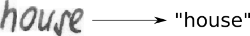

# Handwritten Text Recognition with TensorFlow

Handwritten Text Recognition (HTR) system implemented with TensorFlow (TF) and trained on the IAM off-line HTR dataset.
This Neural Network (NN) model recognizes the text contained in the images of segmented words as shown in the illustration below.

# Train model with IAM dataset

Follow these instructions to get the IAM dataset \[3\]:

* Register at this [website](http://www.fki.inf.unibe.ch/databases/iam-handwriting-database)
* Download `words/words.tgz`
* Download `ascii/words.txt`
* Create a directory for the dataset on your disk, and create two subdirectories: `img` and `gt`
* Put `words.txt` into the `gt` directory
* Put the content (directories `a01`, `a02`, ...) of `words.tgz` into the `img` directory

### Training the model

* Go to the `src` directory and execute `python main.py --train --data_dir path/to/IAM`
* Training stops after a fixed number of epochs without improvement

## Information about model

### Overview

The Model consists of 5 CNN layers, 2 RNN (LSTM) layers and the CTC loss and decoding layer.
The illustration below gives an overview of the NN (green: operations, pink: data flowing through NN) and here follows a short description:

* The input image is a gray-value image and has a size of 128x32
* 5 CNN layers map the input image to a feature sequence of size 32x256
* 2 LSTM layers with 256 units propagate information through the sequence and map the sequence to a matrix of size 32x80. Each matrix-element represents a score for one of the 80 characters at one of the 32 time-steps
* The CTC layer either calculates the loss value given the matrix and the ground-truth text (when training), or it decodes the matrix to the final text with best path decoding or beam search decoding (when inferring)

## Fit model to Recognize text in lines
The model is able to input images of size 128×32 and is able to output at most 32 characters. So, it is possible to recognize one or two words.If the words of the line are easy to segment (large gaps between words, small gaps between characters of a word), then you can use a word-segmentation method.
We can extend the model such that the input is able to fit larger images and the output is able to fit longer character strings. The changes have to be applied to the module Model.py, especially the constants imgSize and maxTextLen have to be adapted.
The Architecture which is used for text-line recognition has a larger input image (800x64) and is able to output larger character strings. Additionally, it contains more CNN layers and uses batch normalization in two layers. Finally, the LSTM layers were replaced by a MDLSTM layer to also propagate information along the vertical image axis.

## Conclusions
Here a Model is developed for recognizing text from the image.Algorithms used in this Model is CNN, RNN and CTC is used for loss calculation.The model is able to input images of size 128×32 and is able to output at most 32 characters. So, it is possible to recognize one or two words. After preprocessing the image as input to the model, we will get the Recognized text. Here Adam optimizer is  used to minimize loss function

## References
\[1\] [Build a Handwritten Text Recognition System using TensorFlow](https://towardsdatascience.com/2326a3487cd5)

\[2\] [Scheidl - Handwritten Text Recognition in Historical Documents](https://repositum.tuwien.ac.at/obvutwhs/download/pdf/2874742)

\[3\] [Marti - The IAM-database: an English sentence database for offline handwriting recognition](http://www.fki.inf.unibe.ch/databases/iam-handwriting-database)
